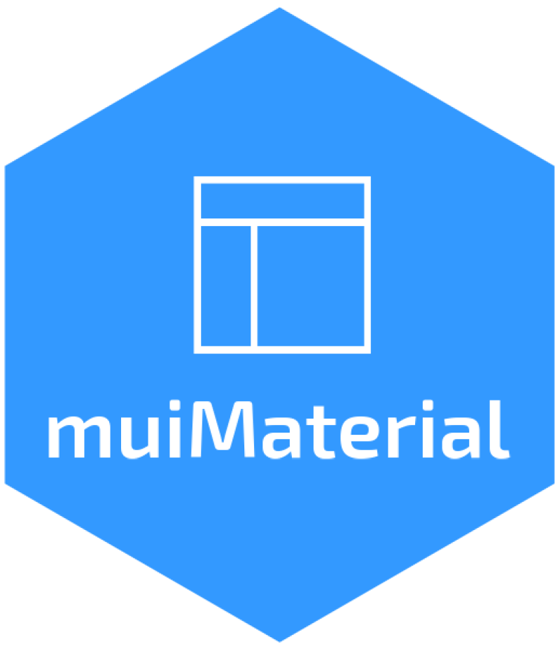

```{r message=FALSE, warning=FALSE, include=FALSE}
# get JS dependencies
dependencies <- jsonlite::fromJSON("js/package.json")$dependencies
```

<!-- badges: start -->
[](https://CRAN.R-project.org/package=muiMaterial)
[](https://github.com/lgnbhl/muiMaterial/actions/workflows/R-CMD-check.yaml)
`r badger::badge_custom(names(dependencies)[3], dependencies[3], "blue", "https://mui.com/material-ui/getting-started/")`
`r badger::badge_custom(names(dependencies)[4], dependencies[4], "blue", "https://mui.com/material-ui/about-the-lab/")`
[](https://www.linkedin.com/in/FelixLuginbuhl)
<!-- badges: end -->

# muiMaterial 

`muiMaterial` brings MUI [Material UI](https://mui.com/material-ui/getting-started/), the world's most popular React UI framework, to R and Shiny.

## Why muiMaterial?

### Go beyond Bootstrap

If Shiny apps look all the same, it is because most use Bootstrap. `muiMaterial` replaces it with Material UI's vast library of components, giving you fully customized dashboards and websites in R.

Launch a basic dashboard (live [here](https://lgnbhl-muimaterial-simple-dashboard.share.connect.posit.cloud)):

```r
muiMaterial::muiMaterialExample("dashboard-simple")
```

Or the R replica of the official MUI dashboard template (live [here](https://lgnbhl-muimaterial-mui-template-dashboard.share.connect.posit.cloud/)):

```r
muiMaterial::muiMaterialExample("mui-template-dashboard")
```

### Built for AI

AI tools like Claude, ChatGPT, or GitHub Copilot have been trained on enormous amounts of MUI code. Each MUI component maps directly to an R function: React's `<Button variant="contained" />` becomes `Button(variant = "contained")` in R. Just ask an AI to generate MUI code and adapt it to R. No React or CSS knowledge needed.

Learn more in the [AI-Assisted Development](https://felixluginbuhl.com/muiMaterial/articles/ai-assisted-development.html) vignette.

### Works with Quarto

`muiMaterial` is not limited to Shiny. You can also use Material UI components in [Quarto](https://quarto.org/) documents for rich, interactive reports and presentations.

### Flexible navigation

Unlike Bootstrap-based packages (`bslib`, `bs4Dash`) that lock you into predefined layouts, `muiMaterial` lets you structure your app however you want. Combine it with [reactRouter](https://felixluginbuhl.com/reactRouter/) to build multi-page websites with [client-side routing](https://felixluginbuhl.com/muiMaterial/articles/routing.html).

### Rich ecosystem

Extend functionality with companion R packages:

- [muiDataGrid](https://felixluginbuhl.com/muiDataGrid/) - Professional data tables with filtering, sorting, and inline editing
- [muiCharts](https://felixluginbuhl.com/muiCharts/) - Beautiful, responsive charts
- [muiTreeView](https://felixluginbuhl.com/muiTreeView/) - Interactive tree navigation
- muiDateTimePickers (COMING SOON) - UI components for selecting dates, times, and ranges

## Quick start

Install the stable version from CRAN:

```r
install.packages("muiMaterial")
```

Or install the development version from GitHub:

```r
pak::pak("lgnbhl/muiMaterial")
```

```r
library(shiny)
library(muiMaterial)

ui <- muiMaterialPage(
  CssBaseline(
    Box(
      sx = list(p = 2),
      Typography("Hello Material UI!", variant = "h4")
    )
  )
)

server <- function(input, output, session) {}

shinyApp(ui, server)
```

Use `muiMaterialPage()` instead of `fluidPage()` and wrap your UI in `CssBaseline()`. Material UI uses its own design system and conflicts with Bootstrap.

For Shiny inputs, server-side rendering, tabs, and styling details, see the [Getting Started](https://felixluginbuhl.com/muiMaterial/articles/getting-started.html) vignette.

Run the showcase to see some Shiny inputs in action:

```r
muiMaterial::muiMaterialExample("showcase")
```

## Resources

- [Package documentation](https://felixluginbuhl.com/muiMaterial/)
- [Getting Started vignette](https://felixluginbuhl.com/muiMaterial/articles/getting-started.html)
- [All R examples](https://github.com/lgnbhl/muiMaterial/tree/main/inst/examples)
- [Official Material UI docs](https://mui.com/material-ui/getting-started/)

## Contributing

Found a bug or have a feature request? [Open an issue](https://github.com/lgnbhl/muiMaterial/issues). Pull requests are welcome.

Follow [Felix Luginbuhl](https://linkedin.com/in/FelixLuginbuhl) on LinkedIn for updates.

## License

This package is released under the [MIT License](LICENSE).
