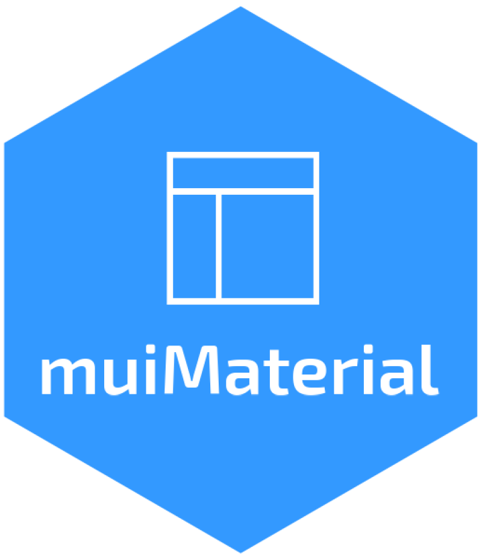

<!-- badges: start -->

[](https://CRAN.R-project.org/package=muiMaterial)
[](https://github.com/lgnbhl/muiMaterial/actions/workflows/R-CMD-check.yaml)
[](https://mui.com/material-ui/getting-started/)
[](https://mui.com/material-ui/getting-started/)
[](https://www.linkedin.com/in/FelixLuginbuhl)
<!-- badges: end -->

# muiMaterial 

**muiMaterial** brings [Material UI
(MUI)](https://mui.com/material-ui/getting-started/), a popular React
component library, to R and Shiny.

## Why muiMaterial?

Shiny dashboards typically rely on Bootstrap, resulting in a similar
look across applications. **muiMaterial** offers a fresh alternative
with Google’s Material Design, giving your dashboards a modern,
distinctive appearance.

- **Break Free from Bootstrap**: Create dashboards that don’t look like
  every other Shiny app.
- **Full UI Customization**: Unlike Bootstrap’s constraints in Shiny,
  **muiMaterial** gives you complete control over design and styling
  through Material UI’s powerful theming system.
- **Flexible Navigation**: With the
  [reactRouter](https://felixluginbuhl.com/reactRouter) R package, build
  fully custom navigation patterns (no standardized layouts like in
  bslib or bs4Dash).
- **Rich Ecosystem**: Extend functionality with companion R packages:
  [muiDataGrid](https://felixluginbuhl.com/muiDataGrid/),
  [muiCharts](https://felixluginbuhl.com/muiCharts/), and
  [muiTreeView](https://felixluginbuhl.com/muiTreeView/).

## Installation

``` r
remotes::install_github("lgnbhl/muiMaterial")
```

## Quick Start

Launch a fully functional dashboard:

``` r
muiMaterial::muiMaterialExample("dashboard-simple")
```

Try the R replica of the [official MUI dashboard
template](https://mui.com/material-ui/getting-started/templates/dashboard/):

``` r
muiMaterial::muiMaterialExample("mui-template-dashboard")
```

Explore available Shiny inputs:

``` r
muiMaterial::muiMaterialExample("showcase")
```

## What You Can Build

**Interactive Shiny Dashboards**

Build [fully customizable Shiny
apps](https://felixluginbuhl.com/muiMaterial/articles/dashboard-basic.html)
with reactive components. All [UI
components](https://felixluginbuhl.com/muiMaterial/reference/) work with
R Shiny and Quarto.

**Multi-Page Applications**

Create multi-page dashboards with client-side routing using
[reactRouter](https://felixluginbuhl.com/reactRouter). [Learn more about
routing](https://felixluginbuhl.com/muiMaterial/articles/routing.html).

**Static Dashboards & Websites**

Create beautiful static dashboards and websites using **muiMaterial**
with [Quarto](https://quarto.org/) combined with
[reactRouter](https://felixluginbuhl.com/reactRouter) for client-side
navigation (no Shiny server required).

**Advanced Data Components**

Extend your apps with specialized MUI companion R packages:

- [muiDataGrid](https://felixluginbuhl.com/muiDataGrid/) - Feature-rich
  data tables with sorting, filtering, and editing
- [muiCharts](https://felixluginbuhl.com/muiCharts/) - Beautiful,
  responsive charts
- [muiTreeView](https://felixluginbuhl.com/muiTreeView/) - Hierarchical
  tree navigation

## Key Concepts

**Shiny Input Wrappers**

Material UI components become Shiny inputs through `*.shinyInput()`
wrapper functions. For example, use `Button.shinyInput()` instead of
`Button()` to capture click events in Shiny.

**Bootstrap-Free Pages**

**muiMaterial** conflicts with Bootstrap CSS (used in
`shiny::fluidPage()` and similar functions). Use `muiMaterialPage()`
instead and wrap your UI in `CssBaseline()` to normalize styles.
Customize styling with the `sx` argument (CSS-in-JS).

``` r
library(shiny)
library(muiMaterial)

ui <- muiMaterialPage(
  CssBaseline(
    Box(
      sx = list(p = 2),
      Typography("Hello Material UI!", variant = "h4")
    )
  )
)

server <- function(input, output, session) {}

shinyApp(ui, server)
```

## Contributing

Found a bug or have a feature request? Open an issue at
<https://github.com/lgnbhl/muiMaterial>

## More Information

- [Documentation](https://felixluginbuhl.com/muiMaterial/)
- [All
  Examples](https://github.com/lgnbhl/muiMaterial/tree/main/inst/examples)
- [Material UI
  Documentation](https://mui.com/material-ui/getting-started/)

Follow [Felix Luginbuhl](https://linkedin.com/in/FelixLuginbuhl) on
LinkedIn for updates.
